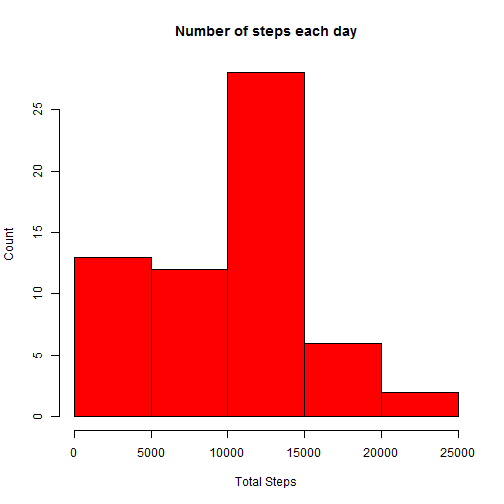
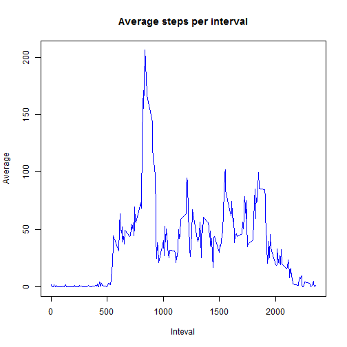
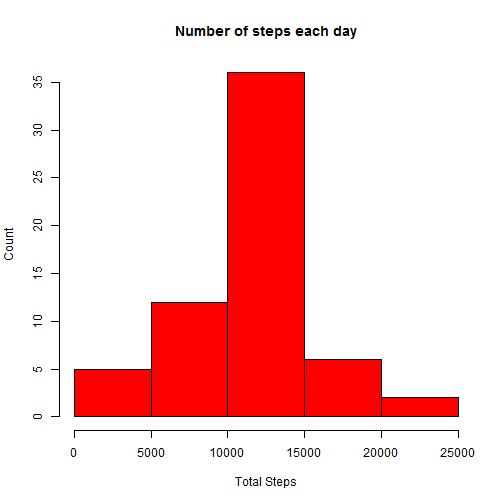
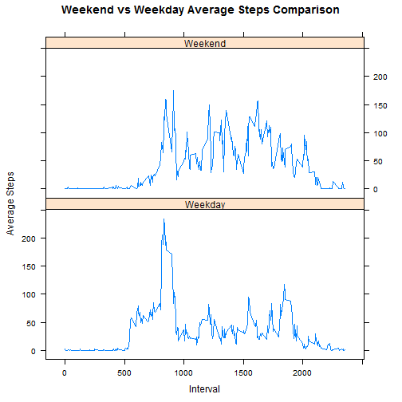

### What is mean total number of steps taken per day?

Load data

```r
activitydf <- read.csv("activity.csv", header = TRUE)
```

```
## Warning in file(file, "rt"): cannot open file 'activity.csv': No such file
## or directory
```

```
## Error in file(file, "rt"): cannot open the connection
```

Calculate the total number of steps taken per day

```r
mydat <- data.frame(tapply(activitydf$steps,activitydf$date,sum , na.rm = TRUE))
names(mydat) <- c("Sum")
mydat
```

```
##              Sum
## 2012-10-01     0
## 2012-10-02   126
## 2012-10-03 11352
## 2012-10-04 12116
## 2012-10-05 13294
## 2012-10-06 15420
## 2012-10-07 11015
## 2012-10-08     0
## 2012-10-09 12811
## 2012-10-10  9900
## 2012-10-11 10304
## 2012-10-12 17382
## 2012-10-13 12426
## 2012-10-14 15098
## 2012-10-15 10139
## 2012-10-16 15084
## 2012-10-17 13452
## 2012-10-18 10056
## 2012-10-19 11829
## 2012-10-20 10395
## 2012-10-21  8821
## 2012-10-22 13460
## 2012-10-23  8918
## 2012-10-24  8355
## 2012-10-25  2492
## 2012-10-26  6778
## 2012-10-27 10119
## 2012-10-28 11458
## 2012-10-29  5018
## 2012-10-30  9819
## 2012-10-31 15414
## 2012-11-01     0
## 2012-11-02 10600
## 2012-11-03 10571
## 2012-11-04     0
## 2012-11-05 10439
## 2012-11-06  8334
## 2012-11-07 12883
## 2012-11-08  3219
## 2012-11-09     0
## 2012-11-10     0
## 2012-11-11 12608
## 2012-11-12 10765
## 2012-11-13  7336
## 2012-11-14     0
## 2012-11-15    41
## 2012-11-16  5441
## 2012-11-17 14339
## 2012-11-18 15110
## 2012-11-19  8841
## 2012-11-20  4472
## 2012-11-21 12787
## 2012-11-22 20427
## 2012-11-23 21194
## 2012-11-24 14478
## 2012-11-25 11834
## 2012-11-26 11162
## 2012-11-27 13646
## 2012-11-28 10183
## 2012-11-29  7047
## 2012-11-30     0
```

If you do not understand the difference between a histogram and a barplot, research the difference between them. Make a histogram of the total number of steps taken each day

```r
hist(mydat$Sum, col = "red", main = "Number of steps each day", xlab = "Total Steps", ylab = "Count")
```


Calculate and report the mean and median of the total number of steps taken per day

```r
mean(mydat$Sum, na.rm = TRUE)
```

```
## [1] 9354.23
```

```r
median(mydat$Sum, na.rm = TRUE)
```

```
## [1] 10395
```
###  What is the average daily activity pattern?

Make a time series plot (i.e. type = "l") of the 5-minute interval (x-axis) and the average number of steps taken, averaged across all days (y-axis)

```r
mydf <- data.frame(round(tapply(activitydf$steps, activitydf$interval, mean, na.rm = TRUE),2))
names(mydf) <- c("Mean")
plot(rownames(mydf), mydf$Mean, type = "l", col = "blue", main = "Average steps per interval", xlab = "Inteval", ylab = "Average")
```


Which 5-minute interval, on average across all the days in the dataset, contains the maximum number of steps?

```r
head(mydf[with(mydf, order(-Mean)), ],1)
```

```
##    835 
## 206.17
```
### Imputing missing values
Calculate and report the total number of missing values in the dataset (i.e. the total number of rows with NAs)

```r
sum(is.na(activitydf$step))
```

```
## [1] 2304
```
Devise a strategy for filling in all of the missing values in the dataset. The strategy does not need to be sophisticated. For example, you could use the mean/median for that day, or the mean for that 5-minute interval, etc.

```r
meandf <- data.frame(tapply(activitydf$steps,activitydf$interval,mean , na.rm = TRUE))
copydf <- activitydf
for ( i in 1:nrow(meandf)) {
copydf [is.na(copydf $step) & copydf$interval == names(meandf[i,]),1] <- meandf[i,1]
}
dim(copydf)
```

```
## [1] 17568     4
```
Make a histogram of the total number of steps taken each day and Calculate and report the mean and median total number of steps taken per day. Do these values differ from the estimates from the first part of the assignment? What is the impact of imputing missing data on the estimates of the total daily number of steps?

```r
mydat <- data.frame(tapply(copydf$steps,copydf$date,sum , na.rm = TRUE))
names(mydat) <- c("Sum")
hist(mydat$Sum, col = "red", main = "Number of steps each day", xlab = "Total Steps", ylab = "Count")
```



Mean and Median 

```r
mean(mydat$Sum, na.rm = TRUE)
```

```
## [1] 10766.19
```

```r
median(mydat$Sum, na.rm = TRUE)
```

```
## [1] 10766.19
```
Mean and Median values are higher than the daa with missing values. This is due to the replacement of the missing values by higher numbers.

### Are there differences in activity patterns between weekdays and weekends?

```r
library(lattice)
```

```r
activitydf$weekday <- ifelse(weekdays(as.Date(activitydf$date)) == "Saturday" | weekdays(as.Date(activitydf$date)) == "Sunday","Weekend","Weekday")
aggdf <- aggregate(activitydf$steps, list(interval = activitydf$interval, dayofweek = activitydf$weekday), mean, na.rm = TRUE)
xyplot(  x ~ interval | dayofweek,aggdf,  type = "l", layout = c(1, 2), ylab = "Average Steps", xlab = "Interval", main = "Weekend vs Weekday Average Steps Comparison")
```


```
There is a difference in the activity level between the weekday and weekend patterns. There  are bigger spikes in activity during the weekday.

